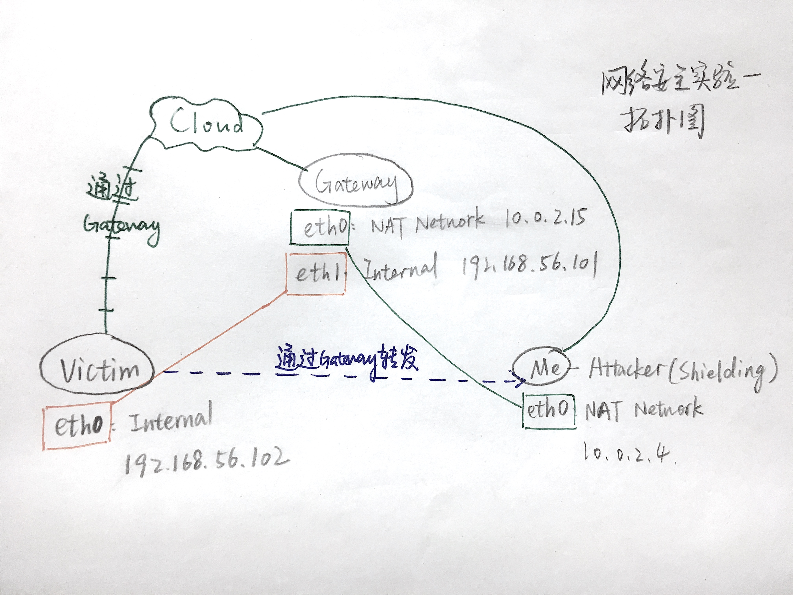
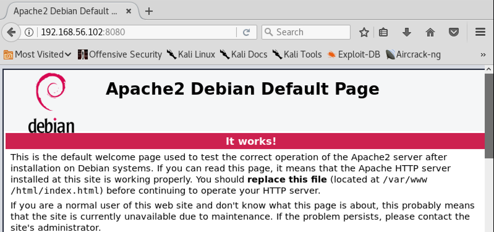
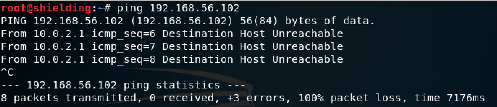
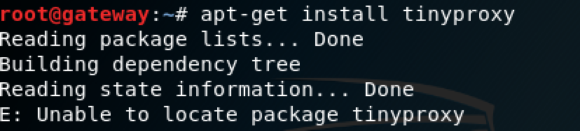
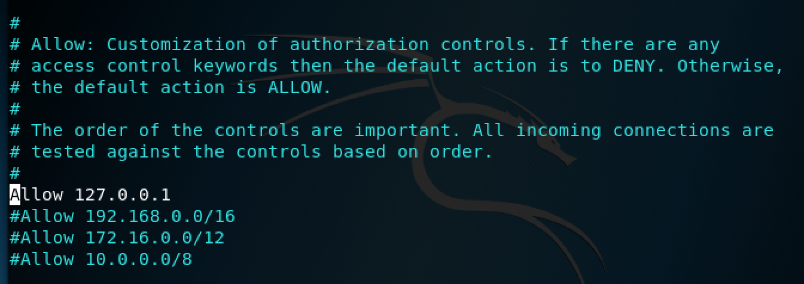
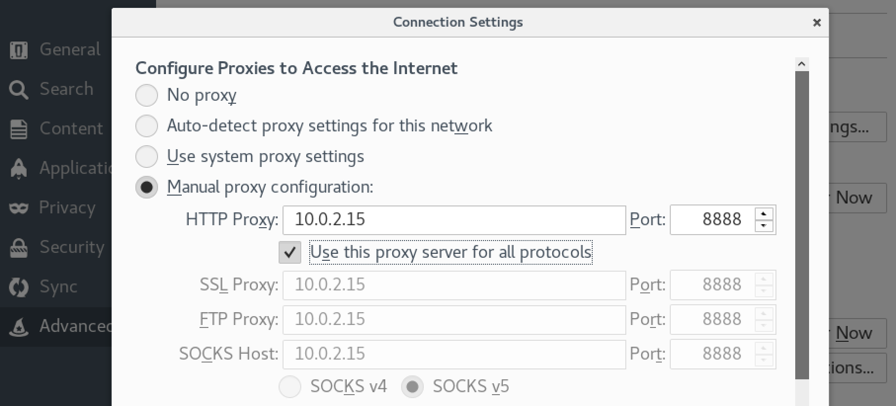
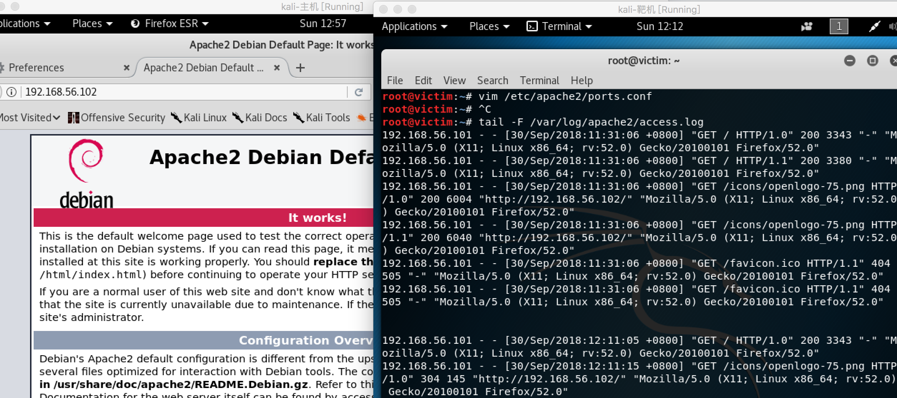

## 代理

*\# 使用与【网络环境搭建】相同的网络拓扑*


### victim开启apache及网络连通状态

首先，在靶机victim上开启apache：


在gateway上可以访问：



而此时在攻击者主机上是ping不通victim的：



想要在攻击者主机上实现访问victim，可以将gateway设置为代理服务器。

### 配置代理

首先，在gateway上安装tinyproxy。出现以下报错：



打开要修改的文件：

```bash
vim /etc/apt/sources.list
```

增加官方存储库：

```bash
deb http://http.kali.org/kali kali-rolling main non-free contrib
deb-src http://http.kali.org/kali kali-rolling main non-free contrib
deb http://http.kali.org/kali kali-rolling main non-free contrib
```

更新：

```bash
sudo apt-get update
```

打开配置：

```bash
vim /etc/tinyproxy/tinyproxy.conf
```

注释掉Allow一句，以允许所有人使用该代理：



启动：

```bash
/etc/init.d/tinyproxy start
```


gateway的代理服务已经配置好，现在在攻击者主机将gateway设为代理，其中8888为tinyproxy默认的端口：



此时，攻击者主机就可以通过gateway的代理访问victim了：


### 查看访问日志

在victim上查看apache的访问日志：

```bash
tail -F /var/log/apache2/access.log
```
刷新左侧在攻击者主机访问victim的页面，victim的访问日志增添右下两条记录，其中一条为请求图片：



注意到显示的包的来源为192.168.56.101，是gateway的地址，说明victim并不知道实际上是攻击者主机（10.0.2.4）在对它进行访问


抓包：

```bash
tcpdump -i eth0 -n -s 65535 -w ap.pcap
```

