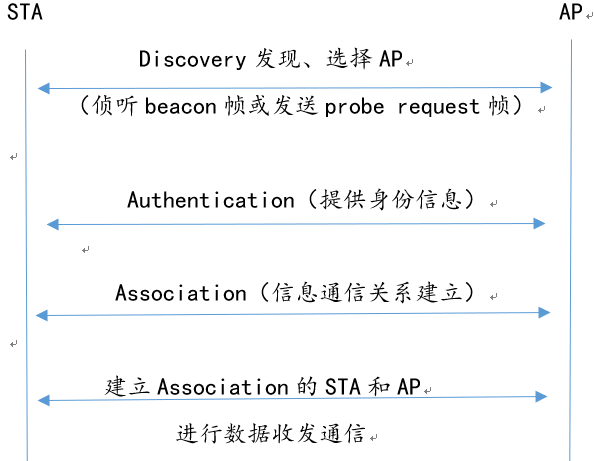
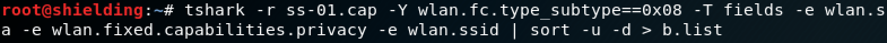
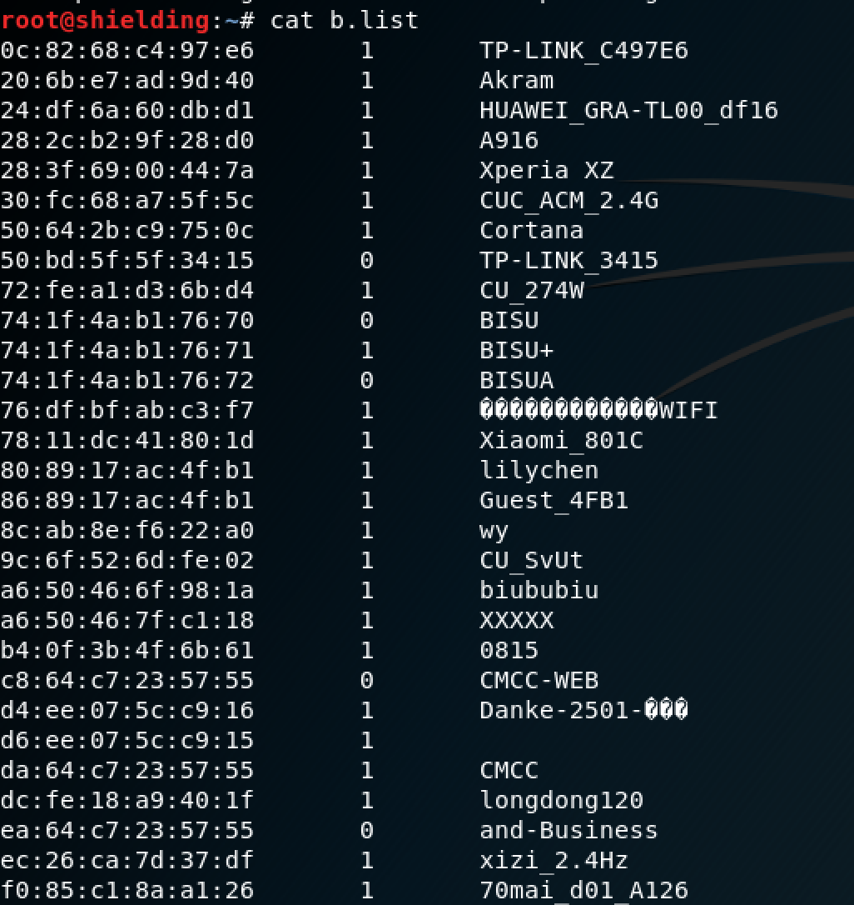
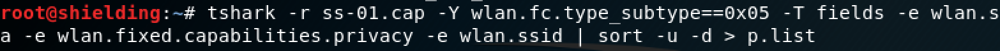
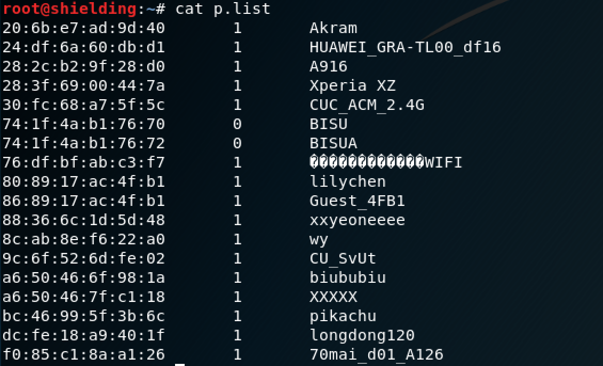
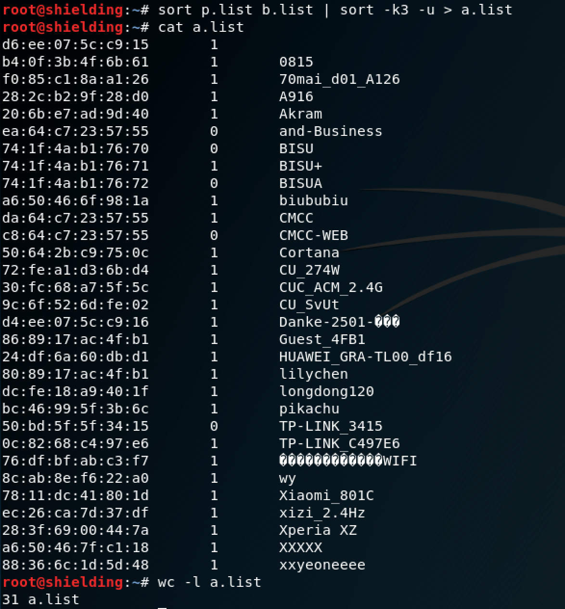
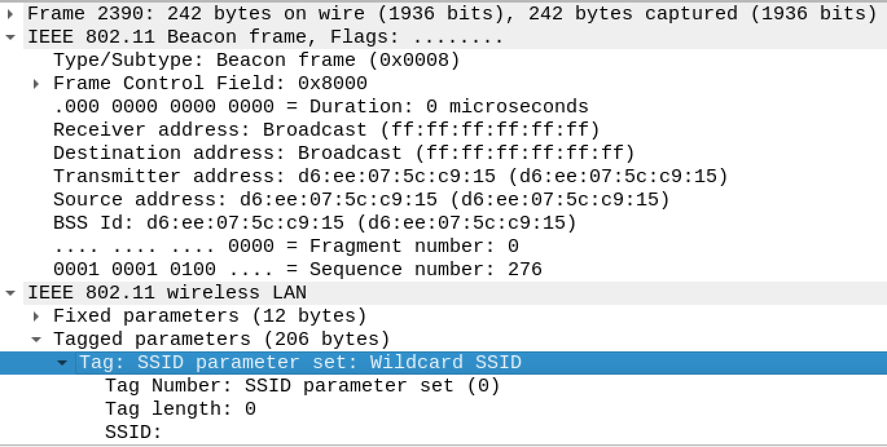
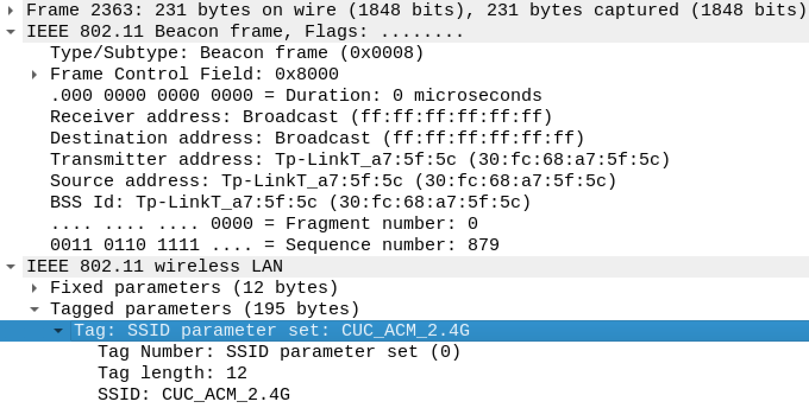
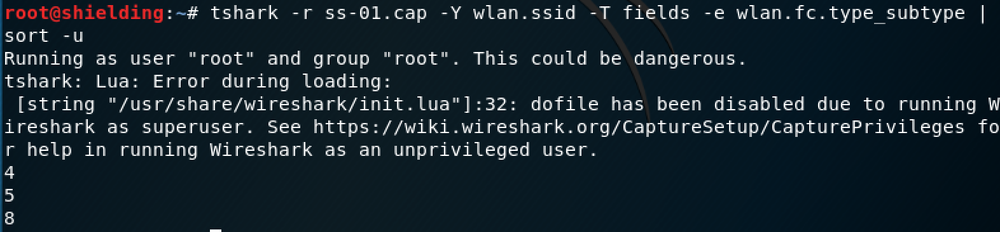

## wifi连接过程
接入点AP会不停发送beacon帧，该帧能到达的范围即wifi覆盖范围。</br>
STA可通过发送probe request帧请求连接</br>
STA发送authentication让AP验证身份后，发送association建立连接




## 简要梳理802.11帧
一般802.11帧分为头部、数据部分和校验码部分，帧头部又主要包括：帧控制域、持续时间/标识、地址域和序列控制域。根据类型的不同又可以分为三类：数据帧、控制帧、管理帧：

1. 数据帧：负责在工作站之间数据传输，可能因为所处的网络环境不同而有所差异。
2. 控制帧：为数据帧服务，负责区域的清空、信道的获取、载波侦听的维护以及在接收到数据时予以确认，从而达到提高工作站之间数据传送的可靠性。
3. 管理帧： 监督管理作用，主要用于加入、退出无线网络和接入点之间关联的转移等。

[过滤规则](https://my.oschina.net/665544/blog/1647001)

## 简要梳理操作
#### 开启网络监听模式：

```bash
airmon-ng start wlan0
```
#### 以channel hopping模式抓包：

```bash
airodump-ng wlan0mon -w ssid --beacons
```
#### 分析抓到的包：
提取beacon帧中出现的ssid：

```bash
tshark -r ssid.cap -Y wlan.fc.type_subtype==0x08 -T fields -e wlan.sa -e wlan.ssid -e wlan.fixed.auth.alg | sort -d -u > b.list
```

提取probe request帧中出现的ssid：

```bash
tshark -r ssid.cap -Y wlan.fc.type_subtype==0x05 -T fields -e wlan.sa -e wlan.ssid| sort -d -u > p.list
```

合并计算ssid数目：

```bash
sort p.list b.list | sort -k3 -u > a.list
```

## 问题解答
#### 1. 查看统计当前信号覆盖范围内一共有多少独立的SSID？其中是否包括隐藏SSID？哪些无线热点是加密/非加密的？加密方式是否可知？

首先根据过滤规则处理抓到的包，显示beacon帧出现的SSID、对应地址和加密与否（根据wlan.fixed.capabilities.privacy判段是否加密，因此添加了这一项）：




然后筛选出probe request帧的：




根据SSID名合并两个list，以计算总共出现的SSID数目：



第二列显示为1的是加密的，如A916；为0的是非加密的，如and-Bustiness。

由此得知共有31个独立SSID，其中SSID名为空的是隐藏SSID，此次抓包没有发现未发送beacon但有STA发送probe request向其请求连接的AP。

其中，名为空的SSID类型为wildcardSSID，长度为0，即隐藏SSID：



选择一个有名字的作对比：



加密方式可以根据认证帧的wlan.fixed.auth.alg判断，0为OpenSystem，1为 SharedKey。

#### 2. 如何分析出一个指定手机在抓包时间窗口内在手机端的无线网络列表可以看到哪些SSID？这台手机尝试连接了哪些SSID？最终加入了哪些SSID？

手机收到AP发送的beacon广播包即相当于看见了AP的SSID；尝试连接时手机向目标AP发送probe request；最终加入的是与AP完成了身份认证和连接过程的。

#### 3. SSID包含在哪些类型的802.11帧？



根据抓包，SSID出现在probe request、probe response和beacon帧中，经查阅资料判断在authentication和association request中也会出现。