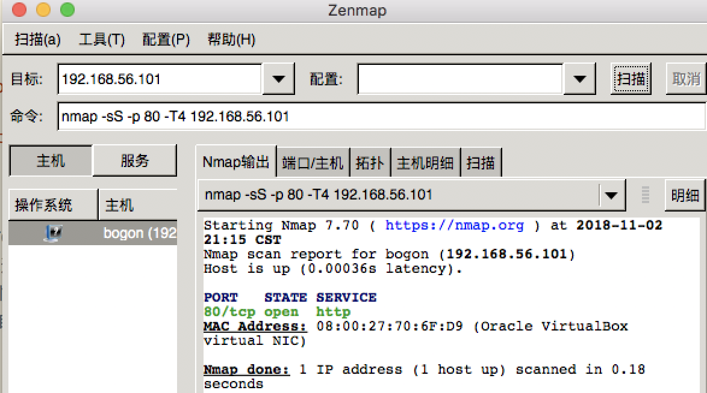

# 0x05 扫描 实验报告

## 实验环境及工具
虚拟机：kali-linux-2018.3-amd64.iso

* scapy (version 2.4.0)
* wireshark (version 2.6.1) 
* nmap (version 7.70)

## 内容
1. TCP connect scan
2. TCP stealth scan
3. TCP XMAS scan
4. UDP scan

## 简介
### 扫描的目的
判断端口的状态、服务类型和版本、得到网络拓扑、系统架构等，构建扫描知识库，寻找目标主机的弱点。

想要偷东西，先踩点看看这家有多少个门、窗、烟囱，都是什么情况。

同一种协议标准在不同操作系统、不同应用系统中表现出了不同的**协议行为**，这种**行为差异**成为了网络扫描识别目标服务、目标主机信息的可行性基础。

### 分类
**主机扫描** & **端口扫描**

端口的状态是构建知识库的基础，可分为开放、关闭和被过滤三种。

主机状态可分为：可达（在线）和不可达（离线）两种。

## 简要复习网络知识
#### TCP header:


ACK、RST、FIN等皆为可以设置为0或1的flag，其中：

1. 确认比特 ACK：只有当 ACK=1 时，确认序号字段才有意义；
2. 复位比特 ReSeT：当 RST=1 时，注解呈现严重错误，必须开释连接，然后再重建传输连接。复位比特还用来拒绝一个不法的报文段或拒绝打开一个连接；
3. 同步比特 SYN：在建立连接时应用；
4. 终止比特 FINal：用来断开一个连接，当 FIN=1 时，请求断开传输连接；

#### TCP/IP协议栈：


系统可以多进程并行，而请求的数据可能来自/去往任何一个进程，所以需要port进行标识，告诉数据应该去哪儿。

#### 三次握手：


“建立连接”的意思为完成三次握手后两方都处于established的状态。

## 工具预备知识
### scapy编程
* TCP flag：

| flag | meaning |
|-------|------|
| 0x002 | SYN |
| 0x004 | RST |
| 0x010 | ACK |
| 0x012 | SYN,ACK |
| 0x014 | RST,ACK |

* ICMP 错误消息type为3时，不同code对应不同含义：

| code | meaning |
|---|--------|
| 1 | Host Unreachable |
| 2 | Protocol Unreachable |
| 3 | Port Unreachable |
| 9	 | Destination network administratively prohibited |
| 10 | Destination host administratively prohibited |
| 13 | Communication administratively prohibited by filtering |

### nmap
* 可以将端口识别为[6种状态](https://nmap.org/man/zh/man-port-scanning-basics.html)
* [扫描方式对应参数](https://nmap.org/man/zh/man-port-scanning-techniques.html)

### nc
netcat命令：

* -l 监听模式，用于入站连接
* -p port 
* -u UDP模式

## 扫描

**注意** nc -l -p [port] 开启端口时，回车该命令即开启，crtl+C结束即关闭。

### TCP connect scan

* 简介：
	* 基于三次握手。向目标端口发送SYN包，若收到的回复为SYN+ACK，则目标端口开放，再发送RST+ACK完成并断开连接；若为RST+ACK，则目标端口关闭，不再发送任何包；若无回复，则目标端口处于过滤状态。
	* 优点：稳定可靠，不需要特殊的权限
	* 缺点：扫描方式不隐蔽，服务器日志会纪录下大量密集的连接和错误记录，并容易被防火墙发现和屏蔽

* scapy 扫描：
	
```bash
import logging
logging.getLogger("scapy.runtime").setLevel(logging.ERROR)
from scapy.all import *

dst_ip = "192.168.56.101"
src_port = RandShort()
dst_port=80

tcp_connect_scan_resp = sr1(IP(dst=dst_ip)/TCP(sport=src_port,dport=dst_port,flags="S"),timeout=10)
if str(type(tcp_connect_scan_resp))=="<class 'NoneType'>":
	print("Filtered")
elif tcp_connect_scan_resp.haslayer(TCP):
	if tcp_connect_scan_resp.getlayer(TCP).flags == 0x12:
		send_rst = sr(IP(dst=dst_ip)/TCP(sport=src_port,dport=dst_port,flags="AR"),timeout=10)
		print("Open")
	elif tcp_connect_scan_resp.getlayer(TCP).flags == 0x14:
		print("Closed")
```


* nmap扫描：-sT对应TCP connect扫描方式


结果一致。用端口52再次尝试，使用Wireshark抓包，过程图如下：

* 端口开启：


* 端口关闭：


### TCP stealth scan

* 简介：
	* 向目标端口发送SYN包，若收到回复为 SYN+ACK ，则目标端口开放，再发送 RST 拒绝连接；若为 RST ，则目标端口关闭，不再发送任何包；若无回复，则目标端口处于过滤状态。
	* 过滤是指由于包过滤阻止探测报文到达端口，可能来自专业的防火墙设备、路由器规则或者主机上的软件防火墙。有时会响应 ICMP 错误消息如类型3代码13 (无法到达目标: 通信被管理员禁止)，但更普遍的是过滤器只是丢弃探测帧，不做任何响应。 

* scapy：

```bash:
import logging
logging.getLogger("scapy.runtime").setLevel(logging.ERROR)
from scapy.all import *

dst_ip = "192.168.56.101"
src_port = RandShort()
dst_port=80

stealth_scan_resp = sr1(IP(dst=dst_ip)/TCP(sport=src_port,dport=dst_port,flags="S"),timeout=10)
if str(type(stealth_scan_resp))=="<class 'NoneType'>":
	print("Filtered")
elif stealth_scan_resp.haslayer(TCP):
	if stealth_scan_resp.getlayer(TCP).flags == 0x12:
		send_rst = sr(IP(dst=dst_ip)/TCP(sport=src_port,dport=dst_port,flags="R"),timeout=10)
		print("Open")
	elif stealth_scan_resp.getlayer(TCP).flags == 0x14:
		print("Closed")
	elif stealth_scan_resp.haslayer(ICMP):
		if int(stealth_scan_resp.getlayer(ICMP).type)==3 and int(stealth_scan_resp.getlayer(ICMP).code) in [1,2,3,9,10,13]:
			print("Filtered")
```
以上代码输出结果为Filtered
简单测试一下，将因为包的返回值类型为NoneType而判断“Filtered”的现实略作修改（添加”hhhhh“），确认是这个原因：


* nmap:





	
### TCP XMAS scan
* 简介：
	* 发送一个 TCP 包，并对 TCP 报文头 FIN、URG 和 PUSH 标记进行设置。若是关闭的端口则响应 RST 报文；开放或过滤状态下的端口则无任何响应。
	* 优点：隐蔽性好
	* 缺点：需要自己构造数据包，要求拥有超级用户或者授权用户权限

* scapy:

```bash
import logging
logging.getLogger("scapy.runtime").setLevel(logging.ERROR)
from scapy.all import *

dst_ip = "192.168.56.101"
src_port = RandShort()
dst_port=80

xmas_scan_resp = sr1(IP(dst=dst_ip)/TCP(dport=dst_port,flags="FPU"),timeout=10)
if str(type(xmas_scan_resp))=="<type 'NoneType'>":
	print("Open|Filtered")
elif xmas_scan_resp.haslayer(TCP):
	if xmas_scan_resp.getlayer(TCP).flags == 0x14:
		print("Closed")
	elif xmas_scan_resp.haslayer(ICMP):
		if int(xmas_scan_resp.getlayer(ICMP).type)==3 and int(xmas_scan_resp.getlayer(ICMP).code) in [1,2,3,9,10,13]:
			print("Filtered")
```

* zmap

端口开放：


端口关闭：


### UDP scan
* 简介：
	* 向各个被扫描的 UDP 端口发送零字节的 UDP 数据包，如果收到一个 ICMP 不可到达的回应，那么则认为这个端口是关闭的,否则认为是开放的。
	* 缺点：
		* 有过滤时收不到回应，会认为所有端口都开放
		*  UDP 是不可靠的，UDP 数据包和 ICMP 错误报文都不保证到达
		*  ICMP 错误消息发送效率是有限的，故而扫描缓慢
		* 非超级用户无法直接读取端口访问错误

端口80关闭：


通过 nc -l -u -p 53 < /etc/passwd 打开53端口：


## 问题


* 使用scapy手动编程会将closed辨识为filtered，确定无法确认原因，真令人灰心丧气 = =

## 参考
* [nmap参考指南](https://nmap.org/man/zh/) [命令介绍](https://nmap.org/book/man-port-scanning-techniques.html)
* [《网络安全》课本](https://sec.cuc.edu.cn/huangwei/textbook/ns/)
* [Port Scanning using Scapy](https://resources.infosecinstitute.com/port-scanning-using-scapy/)