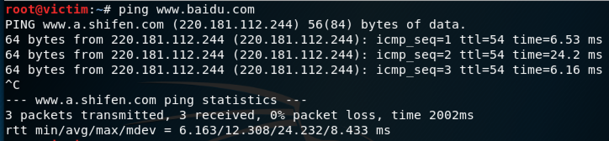

### 网络拓扑图

靶机ip

网关ip

攻击者主机ip

### 靶机可以直接访问攻击者主机
由于默认不开启转发，为实现网关机路由器的功能，开启转发并设置开机启动

### 攻击者主机无法直接访问靶机
显然因为并没有开通网关从internel到NAT Network端口（也就是eth1到eth0）的转发功能，所以主机ping靶机包只会到网关就停下了，ping不通靶机

### 网关可以直接访问攻击者主机和靶机

网关ping靶机和主机，当然都可以通

### 靶机的所有对外上下行流量必须经过网关

靶机的所有对外上下行流量也只能经过网关，不然仅凭一个内部网络的网卡也连不上网

### 所有节点均可以访问互联网
靶机ping外网

网关ping外网

主机ping外网

